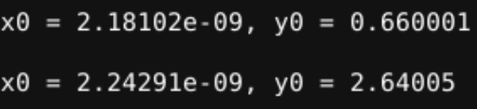

# Advanced-Physical-Design-using-OpenLANE-Sky130
## Day 1 - Inception of open-source EDA, OpenLANE and Sky130 PDK
### Theory
#### How to talk to computers
##### Introduction to QFN-48 Package, chip, pads, core, die and IPs
##### Introduction to RISC-V
##### From Software Applications to Hardware
#### SoC design and OpenLANE 
##### Introduction to all components of open-source digital asic design
##### Simplified RTL2GDS flow
##### Introduction to OpenLANE and Strive chipsets
##### Introduction to OpenLANE detailed ASIC design flow
### Lab
#### Get familiar to open-source EDA tools
##### OpenLANE Directory Structure in Detail
First part includes navigating terminal and the different tools installed on linux. This includes exploring open_pdks and openlane. Open_pdks ensures compatbility of open source tools with existing pdk's. It includes libraries with .ref and .tech extensions that include files related to the process node like timing and lef files as well as the tools utilized in the design of circuits for that node respectively. We will be primiarily using sky130_fd_sc_hd.
Openlane commands
```
cd OpenLane
make mount

$ ./flow.tcl -interactive // This allows each step to be looked at manually.

% package require openlane 0.9
% prep -design picorv32a
% run_synthesis
```
##### Design Preparation Step
```
cd OpenLane
cd designs
ls -al
cd picorv32a
ls -al
tree
```

##### Review files after design prep and run synthesis
```
cd OpenLane/designs/picorv32a/runs/RUN_2023.01.25_06.32.21/tmp
cat merged.lef
cd ../results
cd ../reports
cd ..
cat config.tcl
cat cmds.log
```
This includes information about layers.


##### OpenLANE Project Git Link Description
[OpenLane repo](https://github.com/The-OpenROAD-Project/OpenLane)
```
git clone https://github.com/The-OpenROAD-Project/OpenLane.git
```
Repository contains more detailed information about the OpenLane flow.
This tools takes design files and the target pdk to generate GDSII files.
Interactive mode requires executing steps in order because of generated files function as dependencies for the next stage.
Follow installation steps to have functional setup.

[Fossi Dial Up](https://www.youtube.com/playlist?list=PLUg3wIOWD8yoZCg9XpFSgEgljx6MSdm9L)
##### Steps to characterize synthesis results


## Day 2 - Good floorplan vs bad floorplan and introduction to library cells
### Theory
#### Chip Floor planning considerations 
##### Utilization factor and aspect ratio
##### Concept of pre-placed cells
##### De-coupling capacitors
Learned about decoupling capacitors that help reduce reliance on chip power supply.
##### Power planning
Ground Bounce and Voltage Droop can exceed noise margin due to capacitors discharing for connections through variable bit buses. 
The solution is to provide multiple power supplies as a mesh grid for power rails.
##### Pin placement and logical cell placement blockage
Combine common pins for complete design similar to HDL languages (netlist).
Place pins on region between core and die which should be closest to their respective targets.
Logical cell placement blockage ensures proper placement and floor plan becomes ready for placement and routing.
### Lab
#### Chip Floor planning considerations 
Openlane commands
```
run_floorplan
```
Terminal commands
```
cd Openlane/configuration
vim README.md
vim floorplan.tcl
cd OpenLane/designs/picorv32a
cd OpenLane/designs/picorv32a/runs/<latest>
cd logs/floorplan
vim <4-io.log>
cd ../../
vim config.tcl
cd results/floorplan
vim .def
magic -T </path/to/tech/file> lef read ../../tmp/merged.lef def read </def/file> &
```
Magic commands - drawing
```
<Press s key while hovering over object>
<Press v key>
<Right click bottom left, Right click again for top right>
<Control+z zoom to box>
```
Magic commands - tcl console
```
what
```
##### Steps to run floorplan using OpenLANE
Different variables in configuration readme for different steps in workflow.
Tcl files has default configurations.
Config tcl files have priority from configuration to design folder to prepended sky130 files.
Potential conflicts with newer json files.
##### Review floorplan files and steps to view floorplan
Die area in .def file in results/floorplan set by distance variable


##### Review floorplan layout in Magic

### Theory
#### Library Binding and Placement
##### Netlist binding and initial place design
1. Bind netlist with physical cells
Each block given proper width and height and can be customized in the library.
2. Placement
Must be placed near required pins for better timing.
##### Optimize placement using estimated wire-length and capacitance
This stage will estimate wire length and capacitance to incorporate repeaters to retain signal integrity
##### Final placement optimization
Wire placement can typically criss-cross each other and resolved using separate metal layers. 
##### Need for libraries and characterization
Logic synthesis, floorplanning, placement, clock timing synthesis (cts), routing, static timing analysis implemened with gates and cells which represent library.
### Lab
Openlane commands
```
run_placement
```
Linux terminal
```
cd results/placement
```
##### Congestion aware placement using RePlAce


### Theory
#### Cell design and characterization flows
##### Inputs for cell design flow
Standard cells belong to libraries with different sizes and functionality as well as different threshold voltages. 
Cell design flow include inputs, design steps, and outputs.
Inputs are defined by PDKs, DRC/LVS, spice models, and library- and user-defined specs. 
##### Circuit design step
Specs cover things like cell height, supply voltage, metal layers, pin locations, and drawn gate length.
Design steps include circuit design, layout design, and characterization.
NMOS/PMOS network graph is a potential tool for transoforming circuit design to layout design.
Outputs include CDL file or circuit description language.
##### Layout design step
Art of layout - Euler's path and stick diagram
Output stage also includes GDSII, LEF, and extracted spice list (.cir)
GDSII is layout file, LEF is width and height of cells, and (.cir) includes parasitic capacitances. 
After these steps, characterization is done which will provide timing, noise, power .libs, function
##### Typical characterization flow
1. Read in models of NMOS/PMOS and tech files
2. Read extracted spice netlist
3. Define behavior of buffer
4. Read subcircuits 
5. Attach power supplies and gnd 
6. Apply stimuli
7. Provide necessary output capacitances
8. Provide necessary simulation command
Feed in these steps to GUNA software with a configuration file which generates resulting model for timing, power, and noise characterization.
#### General timing characterization parameters
##### Timing threshold definitions
There are different timing threshold definitions.
slew_low_rise_thr is about 20% and similarly for slew_high_rise_thr (as well as falling edge)
Take 50% of in_rise_thr and similarly for output. (as well as falling edge)
##### Propagation delay and transition time
Propagation delay is equal to the differenc between output and input thresholds for respective measurements.
Delay must be positive. Long wires can increase slew and produce negative delay.
## Day 3 - Design library cell using Magic Layout and ngspice characterization
### Lab
#### Labs for CMOS inverter ngspice simulations
##### IO placer revision
##### SPICE deck creation for CMOS inverter
##### SPICE simulation lab for CMOS inverter
##### Switching Threshold Vm
##### Static and dynamic simulation of CMOS inverter
##### Lab steps to git clone vsdstdcelldesign
#### Inception of Layout and CMOS fabrication process
##### Create Active regions
##### Formation of N-well and P-well
##### Formation of gate terminal
##### Lightly doped drain (LDD) formation
##### Source and drain formation
##### Local interconnect formation
##### Higher level metal formation
##### Lab introduction to Sky130 basic layers layout and LEF using inverter
##### Lab steps to create std cell layout and extract spice netlist


#### Sky130 Tech File Labs
##### Lab steps to create final SPICE deck using Sky130 tech
Connect stimuli for simulation. Change scaling dimension
Magic commands
```
box // to see the proper dimensions for spice deck
```

##### Lab steps to characterize inverter using sky130 model files
Ngspice commands
```
plot y vs time a
<increase C3 to 2fF and rerun>
```



##### Lab introduction to Magic tool options and DRC rules
[Magic](http://opencircuitdesign.com/magic/index.html)
Tutorials and additional commands can be found above.
Technology files contain important information relating to the layout.
Reading Magic documentation is essential to utilizing every aspect of this tool.
##### Lab introduction to Sky130 pdk's and steps to download labs
[open_pdks](http://opencircuitdesign.com/open_pdks/)
Contains information about using Skywater's PDK with open source tools like magic such as an archive of drc tests for reference.
Look at Skywater's PDK documentation for further information about DRC rules.
Potential modification of tech file to change magic behavior.
##### Lab introduction to Magic and steps to load Sky130 tech-rules
Errors found in magic can be explained in the Skywater PDK documentation.
Consult physical design workshop repo for additional work using these EDA tools.
##### Lab exercise to fix poly.9 error in Sky130 tech-file
Changing tech file allows correct DRC rules to be displayed. Additional commands needed to populate modifications and for DRC engine to recognize errors.
##### Lab exercise to implement poly resistor spacing to diff and tap
Cross-referencing rules in tech file and Skywater documentation necessary for correct layout with no DRC violations.
##### Lab challenge exercise to describe DRC error as geometrical construct
##### Lab challenge to find missing or incorrect rules and fix them
Create a rule utilizing cif that finds errors by subtracting layers instead of implementing as an edge-based rule. Save tech file and load in magic as well as made only when drc full is run. Caution: some layers are not yet implemented in magic or are automatically generated.
## Day 4
#### Timing modelling using delay tables
##### Lab steps to convert grid info to track info
*Linux terminal commands:*
```
magic -d XR -T sky130A.tech sky130_inv.mag &
vim /path/to/pdk/sky130A/libs.tech/openlane/sky130_fd_sc_hd/tracks.info
```
*Magic commands*
```
<press g for grid-on>
help grid
grid 0.46um 0.34um 0.23um 0.17um
```
LEF file contains all the relevant information like pins and ports. Intersection of x and y axis indicates ports can be reached with routing tools.


##### Lab steps to convert magic layout to std cell LEF
*Magic commands*
```
edit -> text for converting label to port
port class <output/input/inout>
port use <signal/power/ground>
save sky130_vsdinv.mag
lef write
vim *.lef
```
*Linux terminal*
```
magic -d XR -T sky130A.tech sky130_vsdinv.mag &
```
Standard cell required to be odd multiple of base quantity. Must convert required labels into ports.


##### Introduction to timing libs and steps to include new cell in synthesis
*Linux terminal*
```
cd Openlane/designs/picorv32a/src/
cp vsdstdcelldesign/*.lef ./
vim vsdstdcelldesign/libs/sky130_fd_sc_hd__typical.lib
cp vsdstdcelldesign/libs/sky130_fd_sc_hd__* ./
```

*Openlane commands*
```
cd Openlane
make mount
./flow.tcl -interactive
package require openlane 0.9
prep -design picorv32a -tag <date> -overwrite
set lefs [glob $::env(DESIGN_DIR)/src/*.lef]
add_lefs -src $lefs
run_synthesis
```
Must change lib files in config.tcl

##### Introduction to delay tables
For expected behavior, a designed must verify the timing constraints are met based on load capacitances.
##### Delay table usage Part 1 
Delay tables are based on input slew and output load. Depends of CMOS sizing.
##### Delay table usage Part 2 
Total delay is calculated by summing up each level. Skew = 0 if identical and driving the same loads.
##### Lab steps to configure synthesis settings to fix slack and include vsdinv
*Linux terminal*
```
cd OpenLane/configuration
vim README.md
cd results/placement
magic -d XR -T /usr/local/share/pdk/sky130A/libs.tech/magic/sky130A.tech lef read ../../tmp/merged.nom.lef def read picorv32.def &
```
*OpenLane commands*
```
set ::env(SYNTH_STRATEGY) 1
echo $::env(SYNTH_STRATEGY)
echo $::env(SYNTH_BUFFERING)
echo $::env(SYNTH_SIZING)
set ::env(SYNTH_SIZING) 1
echo $::env(SYNTH_DRIVING_CELL)
run_synthesis
run_floorplan
run_placement
```
Chip area for module '\picorv32': 99853.267200
Look at configuration variables in configuration/README.md
Log files keep track of your changes.


#### Timing analysis with ideal clocks using openSTA 
##### Setup timing analysis and introduction to flip-flop setup time
From launch flop to capture flop is the max time delay between rising clock edge
Setup and hold times result from the propagation delay of transistors.
##### Introduction to clock jitter and uncertainty
Clock jitter results from variations in the production of the clock voltage perhaps from the PLL circuit.
This decreases the max time delay between rising clock edges for setup analysis.
##### Lab steps to configure OpenSTA for post-synth timing analysis
*Linux terminal*
```
cd vsdstdcelldesign/extras
vim sta.conf
vim my_base.sdc
cd OpenLane/scripts/
vim base.sdc
sta pre_sta.conf
```

##### Lab steps to optimize synthesis to reduce setup violations
*Openlane commands*
```
set ::env(SYNTH_MAX_FANOUT) 4
run_synthesis
report_net -connections <netlist>
help replace_cell
replace_cell <first> <second>
report_checks -fields {net cap slew input_pins} -digits 4
```
Bad slew can propagate when chained.
##### Lab steps to do basic timing ECO
*Openlane commands*
```
report_checks -from <first> -to <second> -through
report_tns
report_wns
```
#### Clock tree synthesis TritonCTS and signal integrity
##### Clock tree routing and buffering using H-Tree algorithm
Producing 0 skew requires making distance signal travels equal.
Buffers help reduce the charge time of the load capacitances when placed equally.
##### Crosstalk and clock net shielding
Clock net shielding helps preserve the clock signal integrity when wires are coupled.
