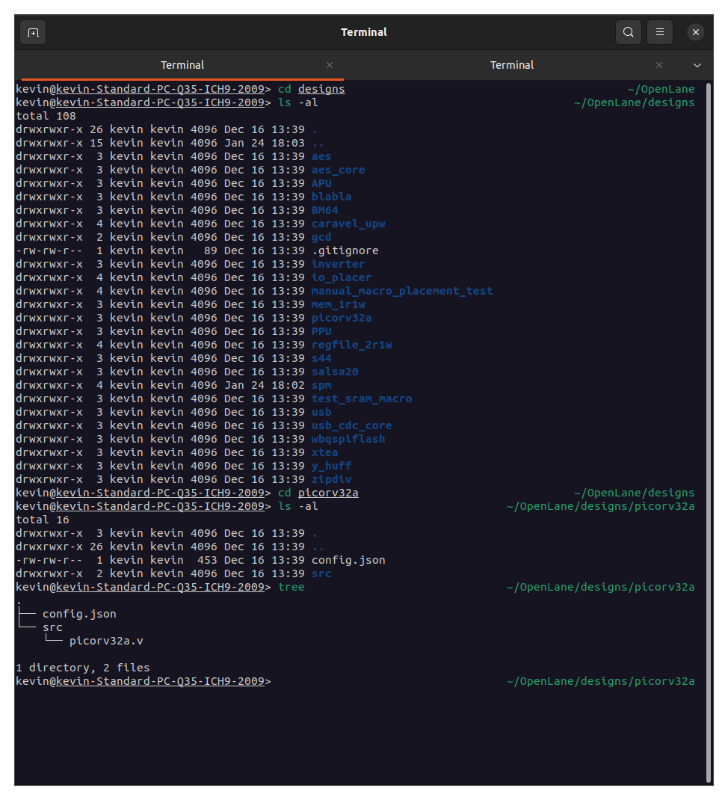

# Advanced-Physical-Design-using-OpenLANE-Sky130
## Day 1 - Inception of open-source EDA, OpenLANE and Sky130 PDK
### Theory
#### How to talk to computers
##### Introduction to QFN-48 Package, chip, pads, core, die and IPs
##### Introduction to RISC-V
##### From Software Applications to Hardware
#### SoC design and OpenLANE 
##### Introduction to all components of open-source digital asic design
##### Simplified RTL2GDS flow
##### Introduction to OpenLANE and Strive chipsets
##### Introduction to OpenLANE detailed ASIC design flow
### Lab
#### Get familiar to open-source EDA tools
##### OpenLANE Directory Structure in Detail
First part includes navigating terminal and the different tools installed on linux. This includes exploring open_pdks and openlane. Open_pdks ensures compatbility of open source tools with existing pdk's. It includes libraries with .ref and .tech extensions that include files related to the process node like timing and lef files as well as the tools utilized in the design of circuits for that node respectively. We will be primiarily using sky130_fd_sc_hd.
* Openlane commands
```
cd OpenLane
make mount

$ ./flow.tcl -interactive // This allows each step to be looked at manually.

% package require openlane 0.9
% prep -design picorv32a
% run_synthesis
```
##### Design Preparation Step
```
cd OpenLane
cd designs
ls -al
cd picorv32a
ls -al
tree
```

##### Review files after design prep and run synthesis
```
cd OpenLane/designs/picorv32a/runs/RUN_2023.01.25_06.32.21/tmp
cat merged.lef
cd ../results
cd ../reports
cd ..
cat config.tcl
cat cmds.log
```
This includes information about layers.


##### OpenLANE Project Git Link Description
[OpenLane repo](https://github.com/The-OpenROAD-Project/OpenLane)
```
git clone https://github.com/The-OpenROAD-Project/OpenLane.git
```
Repository contains more detailed information about the OpenLane flow.
This tools takes design files and the target pdk to generate GDSII files.
Interactive mode requires executing steps in order because of generated files function as dependencies for the next stage.
Follow installation steps to have functional setup.

[Fossi Dial Up](https://www.youtube.com/playlist?list=PLUg3wIOWD8yoZCg9XpFSgEgljx6MSdm9L)
##### Steps to characterize synthesis results


## Day 2 - Good floorplan vs bad floorplan and introduction to library cells
### Theory
#### Chip Floor planning considerations 
##### Utilization factor and aspect ratio
##### Concept of pre-placed cells
##### De-coupling capacitors
Learned about decoupling capacitors that help reduce reliance on chip power supply.
##### Power planning
Ground Bounce and Voltage Droop can exceed noise margin due to capacitors discharing for connections through variable bit buses. 
The solution is to provide multiple power supplies as a mesh grid for power rails.
##### Pin placement and logical cell placement blockage
Combine common pins for complete design similar to HDL languages (netlist).
Place pins on region between core and die which should be closest to their respective targets.
Logical cell placement blockage ensures proper placement and floor plan becomes ready for placement and routing.
### Lab
#### Chip Floor planning considerations 
* Openlane commands
```
run_floorplan
```
* Terminal commands
```
cd Openlane/configuration
vim README.md
vim floorplan.tcl
cd OpenLane/designs/picorv32a
cd OpenLane/designs/picorv32a/runs/<latest>
cd logs/floorplan
vim <4-io.log>
cd ../../
vim config.tcl
cd results/floorplan
vim *.def
magic -T </path/to/tech/file> lef read ../../tmp/merged.lef def read </def/file> &
```
* Magic commands - drawing
```
<Press s key while hovering over object>
<Press v key>
<Right click bottom left, Right click again for top right>
<Control+z zoom to box>
```
* Magic commands - tcl console
```
what
```
##### Steps to run floorplan using OpenLANE
Different variables in configuration readme for different steps in workflow.
Tcl files has default configurations.
Config tcl files have priority from configuration to design folder to prepended sky130 files.
Potential conflicts with newer json files.
##### Review floorplan files and steps to view floorplan
Die area in .def file in results/floorplan set by distance variable


##### Review floorplan layout in Magic

### Theory
#### Library Binding and Placement
##### Netlist binding and initial place design
1. Bind netlist with physical cells
Each block given proper width and height and can be customized in the library.
2. Placement
Must be placed near required pins for better timing.
##### Optimize placement using estimated wire-length and capacitance
This stage will estimate wire length and capacitance to incorporate repeaters to retain signal integrity
##### Final placement optimization
Wire placement can typically criss-cross each other and resolved using separate metal layers. 
##### Need for libraries and characterization
Logic synthesis, floorplanning, placement, clock timing synthesis (cts), routing, static timing analysis implemened with gates and cells which represent library.
### Lab
Openlane commands
```
run_placement
```
Linux terminal
```
cd results/placement
```
##### Congestion aware placement using RePlAce


### Theory
#### Cell design and characterization flows
##### Inputs for cell design flow
Standard cells belong to libraries with different sizes and functionality as well as different threshold voltages. 
Cell design flow include inputs, design steps, and outputs.
Inputs are defined by PDKs, DRC/LVS, spice models, and library- and user-defined specs. 
##### Circuit design step
Specs cover things like cell height, supply voltage, metal layers, pin locations, and drawn gate length.
Design steps include circuit design, layout design, and characterization.
NMOS/PMOS network graph is a potential tool for transoforming circuit design to layout design.
Outputs include CDL file or circuit description language.
##### Layout design step
Art of layout - Euler's path and stick diagram
Output stage also includes GDSII, LEF, and extracted spice list (.cir)
GDSII is layout file, LEF is width and height of cells, and (.cir) includes parasitic capacitances. 
After these steps, characterization is done which will provide timing, noise, power .libs, function
##### Typical characterization flow
1. Read in models of NMOS/PMOS and tech files
2. Read extracted spice netlist
3. Define behavior of buffer
4. Read subcircuits 
5. Attach power supplies and gnd 
6. Apply stimuli
7. Provide necessary output capacitances
8. Provide necessary simulation command
Feed in these steps to GUNA software with a configuration file which generates resulting model for timing, power, and noise characterization.
#### General timing characterization parameters
##### Timing threshold definitions
There are different timing threshold definitions.
slew_low_rise_thr is about 20% and similarly for slew_high_rise_thr (as well as falling edge)
Take 50% of in_rise_thr and similarly for output. (as well as falling edge)
##### Propagation delay and transition time
Propagation delay is equal to the differenc between output and input thresholds for respective measurements.
Delay must be positive. Long wires can increase slew and produce negative delay.
## Day 3 - Design library cell using Magic Layout and ngspice characterization
### Lab
#### Labs for CMOS inverter ngspice simulations
##### IO placer revision
